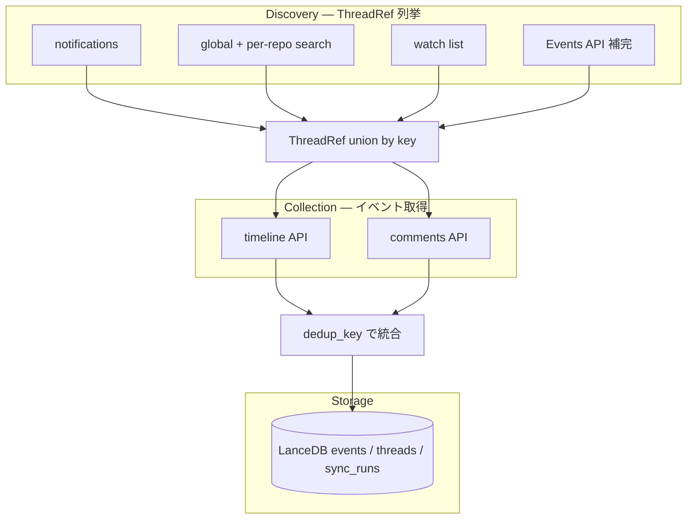

# アーキテクチャ

gh-work-track は GitHub 上の Issue/PR 活動を **ThreadRef**（`repo` + `number` + `kind`）単位で発見し、各スレッドの timeline / comments からイベントを取り込み、LanceDB に upsert する CLI です。

## データフロー



### 2 段階に分かれる理由

GitHub には「ユーザーが関与した全スレッドを期間指定で一覧する」単一 API がありません。そのため:

1. **Discovery** — 複数経路で `ThreadRef` を union する（詳細は [github-api-design.md](github-api-design.md)）
2. **Collection** — 各スレッドについて timeline / comments をページング取得し、`events` テーブル用レコードに変換する

Discovery で拾ったスレッド数が増えると、Collection の API 呼び出しも増えます。incremental sync と per-thread cutoff（README 参照）で Collection コストを抑えます。

## sync のモード

| モード | 起動 | cutoff | watermark |
|---|---|---|---|
| **incremental** | `sync`（引数なし） | 前回成功 run の開始時刻 − `overlap_minutes` | 成功時に更新 |
| **backfill** | `sync --since N` | 直近 N 日 | 更新しない（修復用） |

失敗時に watermark を進めるかどうかは **ソースごとに異なります**（search / notifications 失敗は sync 全体を失敗、Events 失敗は warning のみ）。理由は [github-api-design.md#失敗時ポリシー](github-api-design.md#失敗時ポリシー) を参照。

## 主要コンポーネント

| モジュール | 役割 |
|---|---|
| `github_ops.py` | `gh` / `gh api` 呼び出し、discovery、collection、CLI コマンド |
| `config.py` | `mine_repos` / `search_orgs` / sync 設定 |
| `db.py` | LanceDB、`merge_insert`、`sync_runs` watermark |
| `cli.py` | 引数と設定の解決 |

## ThreadRef

```text
ThreadRef(repo="owner/name", number=42, kind="issue"|"pr")
key = "owner/name#42"   # union / dedupe に使用
```

複数 discovery 経路が同じスレッドを返しても `refs[key]` で 1 件にまとめます。

## 関連

- [GitHub API 利用設計](github-api-design.md)
- [README — 使い方](../README.md)
