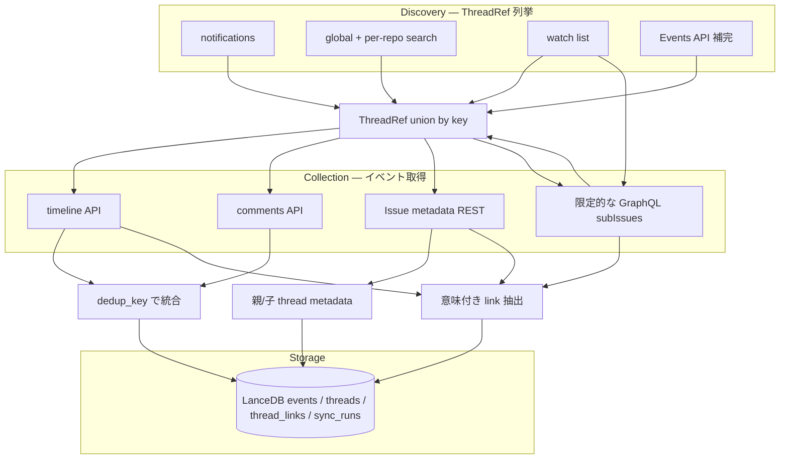

# アーキテクチャ

gh-work-track は GitHub 上の Issue/PR 活動を **ThreadRef**（`repo` + `number` + `kind`）単位で発見し、Issue metadata と各スレッドの timeline / comments からイベント・スレッド間リンクを取り込み、LanceDB に upsert する CLI です。

## データフロー



### 2 段階に分かれる理由

GitHub には「ユーザーが関与した全スレッドを期間指定で一覧する」単一 API がありません。そのため:

1. **Discovery** — 複数経路で `ThreadRef` を union する（詳細は [github-api-design.md](github-api-design.md)）
2. **Collection** — Issue metadata から公式の親子関係を取り込み、各収集対象スレッドについて timeline / comments をページング取得し、`events` テーブル用レコードに変換する

Discovery で拾ったスレッド数が増えると、Collection の API 呼び出しも増えます。incremental sync と per-thread cutoff（README 参照）で Collection コストを抑えます。

## sync のモード

| モード | 起動 | cutoff | watermark |
|---|---|---|---|
| **incremental** | `sync`（引数なし） | 前回成功 run の開始時刻 − `overlap_minutes` | 成功時に更新 |
| **backfill** | `sync --since N` | 直近 N 日 | 更新しない（修復用） |

失敗時に watermark を進めるかどうかは **ソースごとに異なります**（search / notifications 失敗は sync 全体を失敗、Events 失敗は warning のみ）。理由は [github-api-design.md#失敗時ポリシー](github-api-design.md#失敗時ポリシー) を参照。

## 主要コンポーネント

| モジュール | 役割 |
|---|---|
| `github_ops.py` | `gh` / `gh api` 呼び出し、discovery、metadata/collection、CLI コマンド |
| `config.py` | `mine_repos` / `search_orgs` / sync 設定 |
| `db.py` | LanceDB、`merge_insert`、`sync_runs` watermark、thread links |
| `work_groups.py` | 有向 parent 辺（推論 parent は fallback）から WorkGroup anchor を解決 |
| `cli.py` | 引数と設定の解決 |

## ThreadRef

```text
ThreadRef(repo="owner/name", number=42, kind="issue"|"pr")
key = "owner/name#42"   # union / dedupe に使用
```

複数 discovery 経路が同じスレッドを返しても `refs[key]` で 1 件にまとめます。

## Thread links と WorkGroup

REST Issue metadata の `parent_issue_url`、timeline の `cross-referenced` と、
端点を含む enriched payload の `connected` は、イベントとは別に
`thread_links` へ保存します。metadata の親 link は子 → 親、
`source=metadata`、`confidence=1.0`（high）です。link の向きは
`from_thread_key` → `to_thread_key`、`rel` は `parent` / `cross_ref` /
`blocks` / `blocked_by` などです。同じ端点・関係・source の行は upsert され、
再同期しても重複しません。

Issue/PR metadata の body と、timeline に recent activity があり取得した
comments の body からは、キーワード行に限定して低信頼の link を推論します。
`Parent:` / `親:` は `inferred_parent`（confidence 0.3）、`refs:` /
`Related:` / `関連:` は `inferred_ref`（0.6）、PR の `closes` / `fixes` は
`closes`（0.6）として `source=body` と、マッチした行の `evidence` を保存します。
bare `#N` はキーワード行以外では参照せず、コードフェンス・インデントされた
コードも除外します。本文 URL は `owner/repo#number` に正規化しますが、参照先を
discovery や timeline collection へ自動追加しません。

ただし GitHub REST の [documented `connected` event payload](https://docs.github.com/en/rest/using-the-rest-api/issue-event-types#connected)
には、イベント自身の `id` / `url` や commit 情報はありますが、接続先 Issue/PR
の endpoint はありません。Phase 1 は追加 API を呼ばないため、通常の REST sync
では `connected` から `blocks` / `blocked_by` を推測・保存しません。端点を持たない
最近のイベントは warning に記録されます。端点を含む別経路の payload はライブラリ
の抽出器で扱えますが、REST collector が生成するものではありません。

WorkGroup の anchor 解決に使うのは意味が明確な `parent` 辺を優先し、公式 parent
が無い場合だけ `inferred_parent` を候補にします。`inferred_ref` / `closes` は
related context として保持するだけで、無向 connected component を作りません。
parent 辺は子 → 親の向きで、親にイベントがなくても anchor として表示できます。
anchor は metadata 由来の parent、watch 登録、種別・番号の順で優先します。
`cross_ref` や依存辺は `related` として表示しますが、同じグループにはしません。
推論だけで決まった group は `daily --group epic` / `list` で `[inferred]` を付け、
`drill` では body の evidence を表示します。公式 `parent_issue_url` と本文の
`Parent:` が矛盾する場合は warning を出し、metadata の parent を優先します。
parent 辺が循環する場合はデータ不整合として warning を出し、その後に同じ優先順で
deterministic に anchor を選びます。無向 connected components / union-find は使いません。

子の metadata から発見した親は `threads` に最小 metadata とともに登録しますが、
watch リストには自動追加しません。親自身の timeline / comments は同じ同期の対象に
含めず、必要な metadata REST fetch だけを行います。GraphQL `subIssues` は明示的な
watch 親と backfill の discovery 補完に限定します。

通常の `daily` は従来どおりフラットです。`daily --group anchor`（`epic` も可）
だけが日次イベントを anchor 配下へネストし、JSON では各イベントに
`group_anchor` / `group_role` / `related` を追加します。`list` と `drill` は
group anchor と関連スレッドを表示します。

## 関連

- [GitHub API 利用設計](github-api-design.md)
- [README — 使い方](../README.md)
